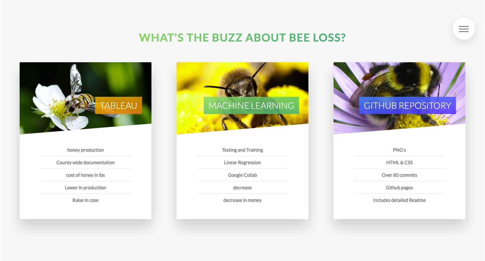
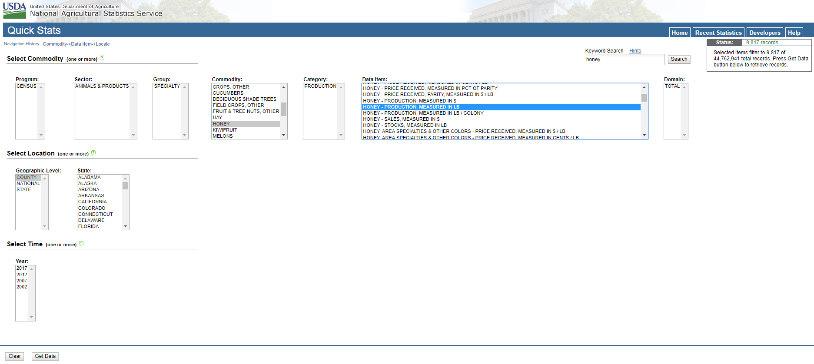
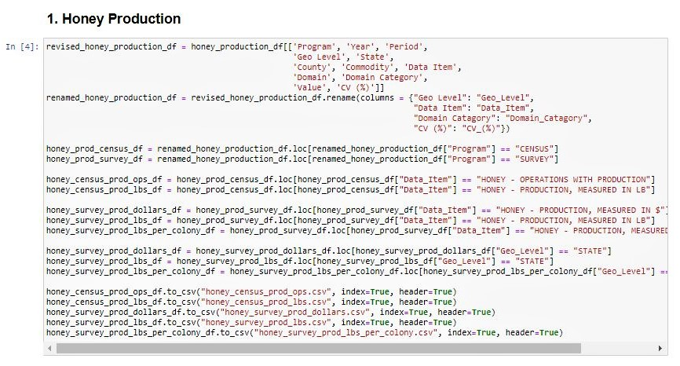
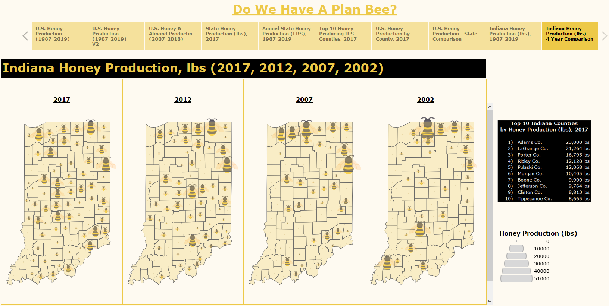
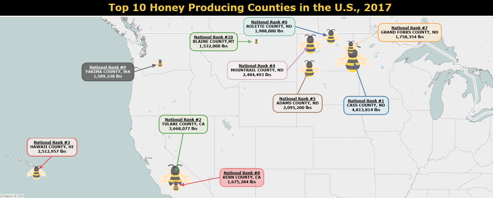
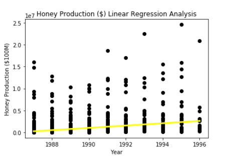
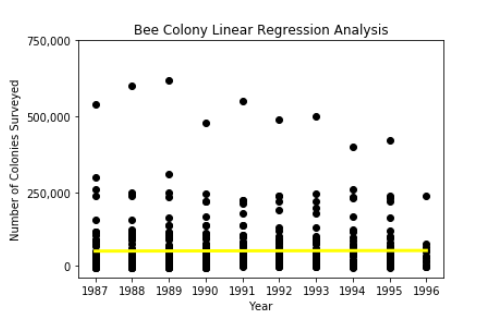
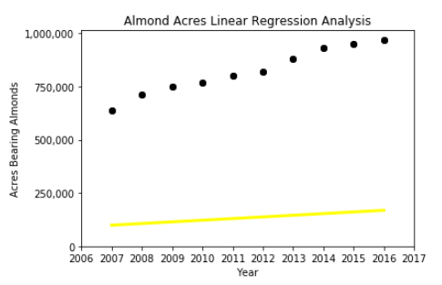
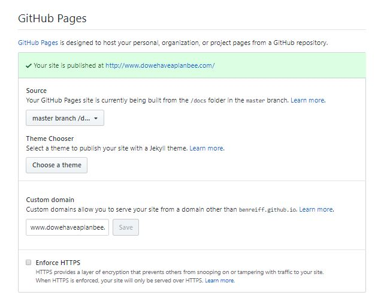

# 
Do We Have a Plan BEE? :bee: Analyzing 30 Years of Honey Data

A data analysis attempting to explain a reduction in the U.S. bee population

# 
  

## Questions to Answer?
- Over the last 30 years, is honey production increasing or decreasing?
- Over the last 30 years, is the value of honey increasing or decreasing?
- Have acres bearing almonds changed as honey production has changed?
- What are the top honey producing states and counties?
- What are the top honey producing counties in Indiana?
- What is the future outlook for bee colonies in the United States based on Year?
- What is the future outlook for almond production in the United States?
- What is the financial future of honey?

## Data Sets to Collect

# 
  

- Data from the USDA is grouped into two programs, with the Census program being more robust:
    <ol start="1">
        <li>Census - collected once every five years (2017, 2012, 2007, 2002).</li>
        <li>Survey - collected every year since 1987.</li>
    </ol>

- Honey production by U.S., state, and county (including all 92 Indiana counties).
- Honey value by U.S., state, and county (including all 92 Indiana counties).
- Bee colony inventory by U.S., state, and county (including all 92 Indiana counties).
- Bee colony loss by U.S., state, and county (including all 92 Indiana counties).
- Acres bearing almonds by U.S. and state.

# 
  

## **E**xtract**T**ransform**L**oad (ETL) the data
- Within Jupyter Notebook/Lab, utilize pandas to load and clean USDA honey data.

# 
  

## Analysis to Run
- Change in honey production by state
- Change in honey value by state from 1987 to 2019
- Change in bee colony inventory from 1987 to 2019
- Change in bee colony loss from 1987 to 2019
- Change in acres bearing almonds

## HTML / CSS
- Utilizes Sass, a powerful professional grade CSS extension library. Sass allows for nesting, variables, and imports to create a neat and simple style sheet.
- Several advanced CSS animations including a pure CSS popup.
- A bio section with several open clickable links per contributor.

# 
  

## Tableau
- A **[Tableau Story](https://public.tableau.com/profile/michael.davis5317#!/vizhome/Do_We_Have_A_Plan_Bee/HoneyStory?publish=yes)** was created that consists of nine different dashboards, which are all incorporated into one easy to understand story.
- Our story is a combination of graphs, charts, and interactive maps.

# 
  

# 
  

## Machine Learning
- We chose to perform a linear regression analysis on our datasets.
- Linear regression can show the relationship between variables (independent and dependent) and allows for forecasting the future, given those trends.
- Linear regression calculates a prediction value based on independent variables and is the most common form of machine learning.

- We will be looking at:
  - Correlation Coefficient - a measure that determines the degree to which the movement of our two variables will be associated
  - Mean Squared Error - the average squared difference between the estimated values and the actual value
  - Coefficient of Determination (R^2) - how differences in one variable can be explained by a difference in the second variable

# 
  

# 
  

# 
  

This notebook incorporates elements from Scikit Machine Learning documentation, Homemade Machine Learning Repository, and Sklearn Multiple Linear Regression.

About Training and Testing:
  - Training data is used for training of our linear model to form an accurate regressive analysis.
  - Testing data will be used for validating our model.

## Deploy the Site
- A custom domain **[DoWeHaveAPlanBee.com](https://www.dowehaveaplanbee.com/)** was purchased and GitHub Pages was used to deploy the live site.

# 
  

## Conclusions
- As honey production (lbs) in the United States has declined 33.4% over the last 30 years, honey value ($) has increased by 161.1%.
- North and South Dakota are the top 2 honey producing states, accounting for 34% of the countries
	production in 2019.
- 5 of the 7 highest honey producing counties are in North Dakota
- In 2019, Indiana ranked 31st in honey production.
- From a high of 1.89 million pounds of honey produced in 1987, Indiana's honey production has fallen 73.7% in 
2019 with just 495,000 pounds produced.
- Acres bearing almonds have increased every year since nationwide data started being collected in 2007.
- Our machine learning analysis proves that the value of honey production is increasing, but the growth has been slow.
- Bee colonies are increasing slightly over time, but the growth has been nearly constant.

- - -
## Tools Used

- Adobe Illustrator
- Adobe Photoshop
- CSS
- GitHub
- GitHub Pages
- HTML
- matplotlib
- Pandas
- Python
- Sass
- scikit-learn
- Tableau

## Authors

- **Ben Reiff** - **[benreiff](https://github.com/benreiff "GitHub for Ben Reiff")**  Ben was the lead on data cleaning and GitHub
- **Chelsea Snedden** - **[chelseasnedden](https://github.com/chelseasnedden "GitHub for Chelsea Snedden")**  Chelsea was the lead on Machine Learning
- **Michael R. Davis** - **[Davis1776](https://github.com/Davis1776 "GitHub for Michael Davis")**  Michael was the lead on Tableau and project management
- **Morgan Bricker** - **[bricker3k](https://github.com/benreiff "GitHub for Morgan Bricker")**  Morgan was the lead on HTML and CSS

## Acknowledgments

- Data Source: [United States Department of Agriculture (USDA)](https://quickstats.nass.usda.gov/ "USDA Quickstats")
- [Tableau](https://www.tableau.com/ "Tableau Homepage") was used to create the data visualizations.
- [Seaborn](https://seaborn.pydata.org/ "Seaborn") was used to create machine learning plots.
- [scikit-learn](https://scikit-learn.org/stable/ "scikit-learn") was used to create machine learning plots.
- [Plotly.js documentation](https://plot.ly/javascript/ "Plot.ly") was used to help create machine learning plots.
- [Butler University Data Analytics and Visualization Executive Education program](https://www.butler.edu/executive-education "Butler University Executive Education program") and instructors for assistance.
- Hat tip to Triology Education Services for providing the challenge guidelines.
- Partially inspired by the Oscar nominated documentary [HoneyLand](https://www.imdb.com/title/tt8991268/ "IMDB's Honeyland page")

## Copyright
:copyright: 2020 Ben Reiff, Chelsea Snedden, Michael R. Davis, Morgan Bricker. All Rights Reserved.
- - -