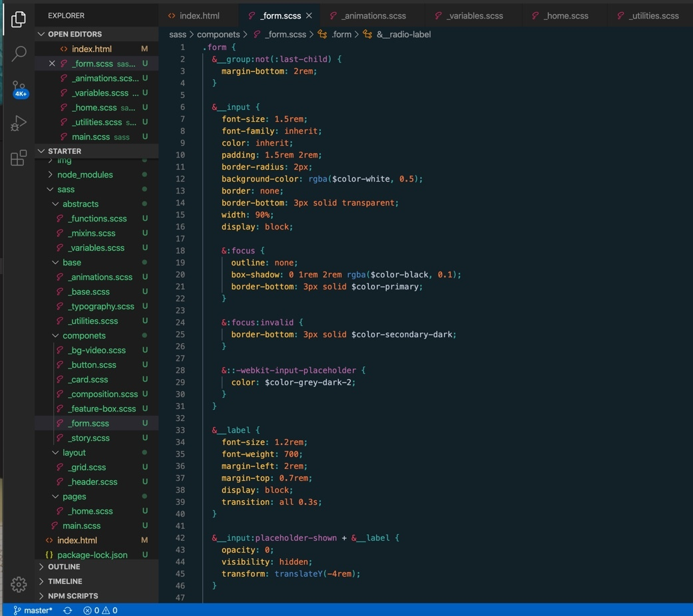

# 
Do We Have a Plan BEE? :bee: A Machine Learning Study

A data analysis attempting to explain a reduction in the bee population
- insert image from website we create

## Questions to Answer?
* 

## Obtain Data

# 
  

## Data Sets to Collect (2017, 2012, 2007, 2002 - census years)
* Honey production by state
* Honey production by county
* Indiana honey production by county

* Honey value by state
* Honey value by county
* Indiana honey value by county

* Bee colony inventory by state
* Bee conony inventory by county
* Indiana bee colony inventory by county

* Bee colony loss by state
* Bee conony loss by county
* Indiana bee colony loss by county

* Acres bearing almonds by state
* Acres bearing almonds by county
* Indiana Acres bearing almonds by county

## **E**xtract**T**ransform**L**oad (ETL) the data
- Utilizing Jupyter Notebook/Lab, utilize pandas to load and clean USDA honey data.
- insert image - section of code showing ETL

## Analysis to Run
* Change in honey production by state
* Change in honey value by state from
* Change in bee colony inventory from
* Change in bee colony loss from
* Change in acres bearing almonds

* Coorelate almond production to decrease in bee production

## HTML / CSS

# 
  

## Machine Learning
- insert image
- supervised vs unsupervised - why we choose one technique over the other?
- do not overfit or underfit the data
- need a measure of fitness (R2)
- understand difference between precision and accuracy
- if using linear regression, use lots of scatter plots and lines
- multi-regression (a lot vs. one)

## Tableau
- insert image

## Deploy the site to go live
- insert image

## Conclusions
- killing bees is bad
- almond growth

- - -
## Tools Used

* Python
* Pandas
* HTML
* CSS
* Tableau
* GitHub and GitHub Pages
* for ML ??
* 
* 
* 

## Authors

- after each person add the job responsibilies they had

* **Ben Reiff** - **[benreiff](https://github.com/benreiff)**
* **Chelsea Snedden** - **[chelseasnedden](https://github.com/chelseasnedden)**
* **Michael R. Davis** - **[Davis1776](https://github.com/Davis1776)**
* **Morgan Bricker** - **[bricker3k](https://github.com/benreiff)**

## Acknowledgments

* Data Source: [United States Department of Agriculture (USDA)](https://quickstats.nass.usda.gov/)
* Data Source:
* 
* 
* [Tableau](https://www.tableau.com/) was used to create the data visualizations.
* [Plotly.js documentation](https://plot.ly/javascript/) was used to help build the plots.
* [Butler University Data Analytics and Visualization Executive Education program](https://www.butler.edu/executive-education) and instructors for assistance.
* Hat tip to Triology Education Services for providing the challenge guidelines.
* Partially inspired by the Oscar nominated documentary [HoneyLand](https://www.imdb.com/title/tt8991268/)

## Copyright
Ben Reiff, Chelsea Snedden, Michael R. Davis, Morgan Bricker © 2020. All Rights Reserved.
- - -