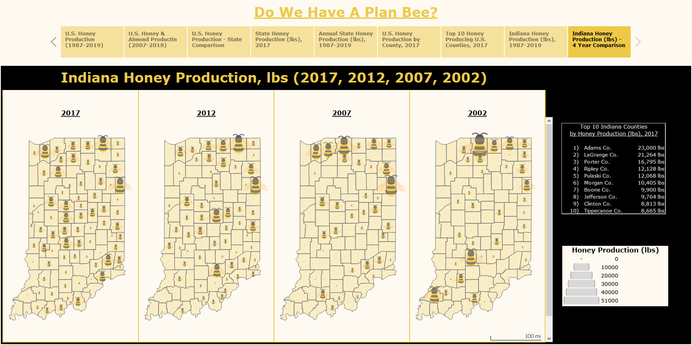

# 
Do We Have a Plan BEE? :bee: Analyzing 30 Years of Honey Data

A data analysis attempting to explain a reduction in the bee population

# 
  

## Questions to Answer?
* Over the last 30 years, is bee production increasing or decreasing?
* Over the last 30 years, is the value of honey production increasing or decreasing?
* What are the top producing honey production states and counties?
* What are the top producting honey production counites in Indiana?
* Has almond acres bearings changed as honey production has changed?

## Obtain Data

# 
  

## Data Sets to Collect (2017, 2012, 2007, 2002 - census years)
* Honey production by state, county, and Indiana county
* Honey value by state, county, and Indiana county
* Bee colony inventory by state, county, and Indiana county
* Bee colony loss by state, county, and Indiana county
* Acres bearing almonds by state

# 
  

## **E**xtract**T**ransform**L**oad (ETL) the data
- Utilizing Jupyter Notebook/Lab, utilize pandas to load and clean USDA honey data.
- insert image - section of code showing ETL
# 
  

## Analysis to Run
* Change in honey production by state
* Change in honey value by state from
* Change in bee colony inventory from
* Change in bee colony loss from
* Change in acres bearing almonds

* Coorelate almond production to decrease in bee production

## HTML / CSS

# 
  

## Machine Learning
- insert image
- supervised vs unsupervised - why we choose one technique over the other?
- do not overfit or underfit the data
- need a measure of fitness (R2)
- understand difference between precision and accuracy
- if using linear regression, use lots of scatter plots and lines
- multi-regression (a lot vs. one)

## Tableau

# 
  

## Deploy the Site to Go Live

# 
  

## Conclusions
- As almond production has gone up, honey production has gone down
- As honey production has gone down, honey value has gone up

- - -
## Tools Used

* Python
* Pandas
* HTML
* CSS
* Tableau
* GitHub
* GitHub Pages
* Seaborn
* Photoshop
* Adobe Illustrator
* scikit-learn
* matplotlib

## Authors

* **Ben Reiff** - **[benreiff](https://github.com/benreiff "GitHub for Ben Reiff")**  Ben was the lead on data cleaning and GitHub
* **Chelsea Snedden** - **[chelseasnedden](https://github.com/chelseasnedden "GitHub for Chelsea Snedden")**  Chelsea was the lead on Machine Learning
* **Michael R. Davis** - **[Davis1776](https://github.com/Davis1776 "GitHub for Michael Davis")**  Michael was the lead on Tableau and project management
* **Morgan Bricker** - **[bricker3k](https://github.com/benreiff "GitHub for Morgan Bricker")**  Morgan was the lead on HTML and CSS

## Acknowledgments

* Data Source: [United States Department of Agriculture (USDA)](https://quickstats.nass.usda.gov/ "USDA Quickstats")
* [Tableau](https://www.tableau.com/ "Tableau Homepage") was used to create the data visualizations.
* [Seaborn](https://seaborn.pydata.org/ "Seaborn") was used to create machine learning plots.
* [scikit-learn](https://scikit-learn.org/stable/ "scikit-learn") was used to create machine learning plots.
* [Plotly.js documentation](https://plot.ly/javascript/ "Plot.ly") was used to help build the plots.
* [Butler University Data Analytics and Visualization Executive Education program](https://www.butler.edu/executive-education "Butler University Executive Education program") and instructors for assistance.
* Hat tip to Triology Education Services for providing the challenge guidelines.
* Partially inspired by the Oscar nominated documentary [HoneyLand](https://www.imdb.com/title/tt8991268/ "IMDB's Honeyland page")

## Copyright
Ben Reiff, Chelsea Snedden, Michael R. Davis, Morgan Bricker © 2020. All Rights Reserved.
- - -
